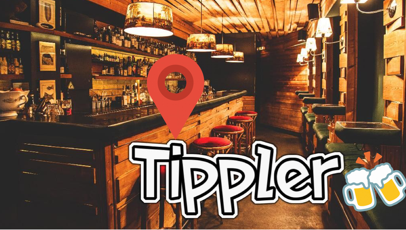

## TIPPLER

***

Finding a bar near you just got a lot easier!  
Bars are seen as a social venue, and function as a social center for a local community  
— a place to meet friends and form networks, while fostering community spirit. 
Get the location of the Bar/Launge/Pub right around the corner..  
Tippler is a RStudio-Shiny App desinged uniquely to locate the nearest bars within 2 Km from you!

***

## *Locate the happening bars around you with [Tippler](https://jayendrashinde91.shinyapps.io/tippler/)

***

## *Features

Yelp, the “best way to find local businesses,”  
Gain easy access to search results and local business information from over 50 million businesses in 27 countries.  

By using the Yelp API you’ll be able to:

* Find up to 40 best results for a geographically-oriented search
* Sort results by the best match for the query, highest ratings, or distance
* Limit results to those businesses offering a Yelp Deal, and display information about the deal like the title, savings, and purchase URL
* Identify and display whether a business has been claimed on Yelp.com

***

Leaflet is one of the most popular open-source JavaScript libraries for interactive maps.  It’s used by websites ranging from The New York Times and The Washington Post to GitHub and Flickr, as well as GIS specialists like OpenStreetMap, Mapbox, and CartoDB.This R package makes it easy to integrate and control Leaflet maps in R.

